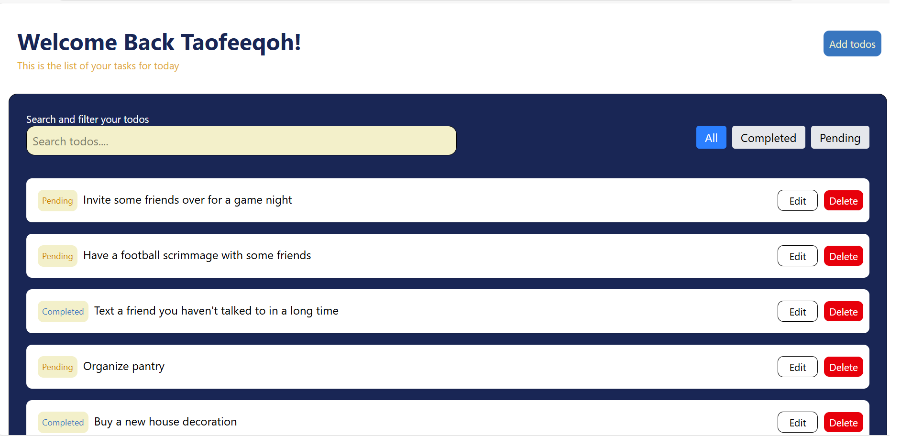
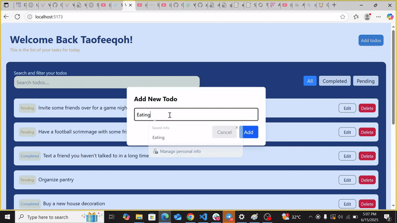

# Todo App <br>

A modern Todo application built with React, TypeScript, TailwindCSS, TanStack Query, and Vite. Now powered by Supabase for real-time database and authentication. Effortlessly manage your tasks with features like adding, editing, filtering, pagination, and search—all in a responsive interface.

---


## ✨ Features <br>

- User authentication and secure access via Supabase
- Real-time database: add, edit, and delete todos
- Paginate todos (10 per page)
- Filter todos by status: All, Completed, or Pending
- Search todos by title
- Responsive design for mobile and desktop
- Modal dialogs for adding and editing todos
- Nested routing for detailed todo views

---

## 🛠️ Installation & Setup <br>

1. **Clone the repository** <br>
	```sh
	git clone https://github.com/taofeeqoh04/todo-app.git
	cd todo-app
	```

2. **Install dependencies** <br>
	```sh
	npm install
	```

3. **Start the development server** <br>
	```sh
	npm run dev
	```

4. **Technology Stack** <br>
	- React
	- Vite
	- Tailwind CSS
	- TanStack Query
	- React Router
	- Axios
	- Supabase (Database & Auth)

5. **Database & Authentication** <br>
	- All todo data and user authentication are managed via Supabase.
	- Todos are stored and updated in real-time in the Supabase database.

6. **Screenshots** <br>
	
	
	
	

7. **Demo** <br>
	

8. **Build for production** <br>
	```sh
	npm run build
	```