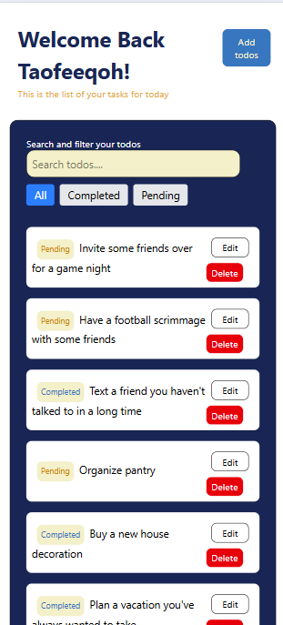

# Todo App  

A full-featured Todo application built with React, TailwindCSS, TanStack Query, and Vite. Users can add, edit, and filter tasks. It includes pagination, search, and responsive design.

---

## ✨ Features  

- Display todos from external API
- Add, and edit todos
- Pagination (10 todos per page)
- Filter by status (All, Completed, Pending)
- Search by todo title
- Modal components for edit/add
- Responsive design (mobile to desktop)
- Nested route for todo details

---

## 🛠️ Installation & Setup  

1. **Clone the repository**  

git clone https://github.com/taofeeqoh04/todo-app.git
cd todo-app

2. **Install dependencies**  

npm install

3. **Start Server**  

npm run dev

4. **Technology Stack**  
React
Vite
Tailwind CSS
TanStack Query
React Router
Axios
DummyJSON API

5. **API Documentation & Usage**  
Base URL: https://dummyjson.com/todos

Endpoints:

GET /todos - fetch all todos

GET /todos/:id - fetch todo by ID

Note: DummyJSON is a read-only API. Actions like add/edit will simulate but not persist.

6. **Screenshot of the Todo App**  

7. **Todo App Demo**  
